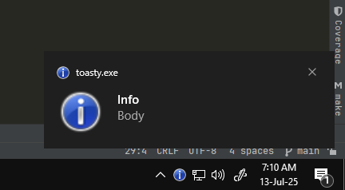

# Toasty

A library to send and process simple notifications on Windows.
The goal of this library is to have no external dependencies other than windows itself and a C compiler.

> CGO is required to build code using this library

> This is still very much in an experimental phase.

After searching around Microsoft's docs and forums for a few days,
I've come to the conclusion that while there are newer APIs for sending toast notifications,
Win32 is still by far the most stable and future-proof API there is.

Microsoft introduced an improved version of toast notifications using [WinRT/COM](https://learn.microsoft.com/en-us/windows/apps/design/shell/tiles-and-notifications/toast-notifications-overview)
which supports some fancy styling, but getting this API to work on things that aren't actual desktop applications has been a nightmare,
and the fact that WinRT has been deprecated does not give me confidence.

If you do want that styling, it'll probably be easier to use a powershell script to do the work for you and there are some Go libraries that already do that.

# Example

```go
package main

func main() {
	defer toasty.SendTransientNotification("Info", "Body", 10*time.Second)()
	time.Sleep(5 * time.Second)
}
```


